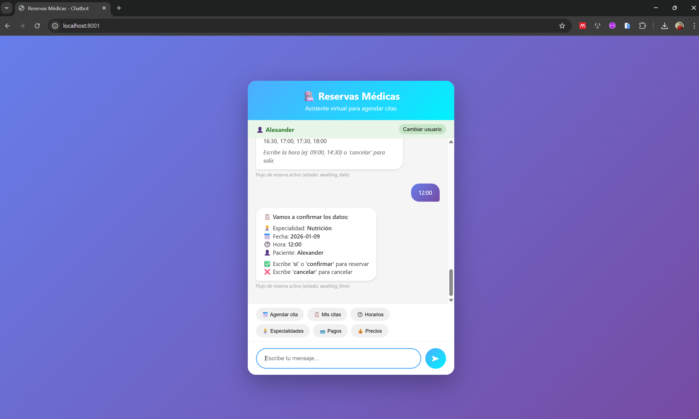
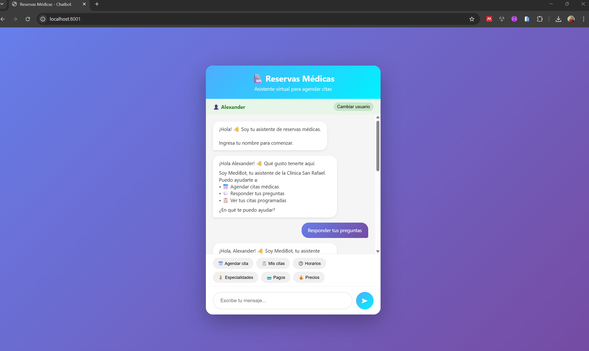

# Sistema de Reservas Médicas con Chatbot Inteligente

## Información del Proyecto

| Campo | Detalle |
|-------|---------|
| **Autor** | Alexander Andre Chavez Cabana |
| **Curso** | Diseño e Implementación de Chatbots |
| **Sesión** | S5 |
| **Docente** | Angelo Castillo |
| **Fecha** | Enero 2026 |

---

## 1. Introducción

El presente proyecto implementa un sistema de chatbot para la gestión de citas médicas, desarrollado como parte del curso de Diseño e Implementación de Chatbots. El sistema integra tecnologías de procesamiento de lenguaje natural (NLP) y modelos de lenguaje de gran escala (LLM) para proporcionar una experiencia conversacional fluida y natural.

### 1.1 Objetivos

- Implementar un chatbot funcional para reservas médicas
- Integrar un modelo de lenguaje (Google Gemini) para respuestas generativas
- Desarrollar un flujo conversacional guiado para el proceso de reservas
- Aplicar técnicas de NLP para la detección de intenciones

---

## 2. Capturas del Sistema

### 2.1 Interfaz de Reservas

La siguiente imagen muestra el proceso de reserva de citas médicas a través del chatbot:



*Figura 1: Flujo de reserva de citas médicas*

### 2.2 Respuestas Generativas con LLM

La siguiente imagen muestra las respuestas generadas por el modelo Gemini:



*Figura 2: Respuestas generativas del modelo de lenguaje*

---

## 3. Arquitectura del Sistema

El sistema está compuesto por los siguientes módulos:

```
┌─────────────────────────────────────────────────────────────┐
│                    CAPA DE PRESENTACIÓN                      │
│                     (static/index.html)                      │
└─────────────────────────────┬───────────────────────────────┘
                              │
┌─────────────────────────────▼───────────────────────────────┐
│                      CAPA DE API                             │
│                  FastAPI (main.py)                           │
│           POST /users | POST /chat | GET /appointments       │
└─────────────────────────────┬───────────────────────────────┘
                              │
┌─────────────────────────────▼───────────────────────────────┐
│                   CAPA DE LÓGICA DE NEGOCIO                  │
│                                                              │
│  ┌────────────┐  ┌────────────┐  ┌────────────┐             │
│  │  Seguridad │  │    Flow    │  │    FAQ     │             │
│  │   Filter   │  │  Reservas  │  │   TF-IDF   │             │
│  └────────────┘  └────────────┘  └────────────┘             │
│                                                              │
│  ┌────────────┐  ┌────────────┐                             │
│  │   Memory   │  │   Gemini   │                             │
│  │  Manager   │  │    LLM     │                             │
│  └────────────┘  └────────────┘                             │
└─────────────────────────────┬───────────────────────────────┘
                              │
┌─────────────────────────────▼───────────────────────────────┐
│                    CAPA DE DATOS                             │
│              JSON (users | chats | appointments)             │
└─────────────────────────────────────────────────────────────┘
```

---

## 4. Estructura del Proyecto

```
reservas_medicas/
│
├── main.py                  # Servidor FastAPI y endpoints
├── reservas_llm.py          # Servicio principal del chatbot
├── reservas_flow.py         # Máquina de estados para reservas
├── reservas_faq.py          # Sistema de preguntas frecuentes
├── reservas_database.py     # Operaciones de base de datos
├── reservas_memory.py       # Gestión de contexto conversacional
├── reservas_models.py       # Modelos de datos (Pydantic)
├── reservas_sequrity.py     # Filtros de seguridad
├── reservas_config.py       # Configuración del sistema
├── reservas_actions.py      # Acciones ejecutables
├── requirements.txt         # Dependencias del proyecto
├── .env                     # Variables de entorno
│
├── static/
│   └── index.html           # Interfaz de usuario web
│
├── imagen/
│   ├── imagereserva.png     # Captura del sistema de reservas
│   └── imagellm.png         # Captura de respuestas LLM
│
└── data/
    ├── users.json           # Registro de usuarios
    ├── chats.json           # Historial de conversaciones
    └── appointments.json    # Citas programadas
```

---

## 5. Tecnologías Utilizadas

| Categoría | Tecnología | Versión/Descripción |
|-----------|------------|---------------------|
| Backend | Python | 3.10+ |
| Framework Web | FastAPI | Framework asíncrono de alto rendimiento |
| Servidor | Uvicorn | Servidor ASGI |
| LLM | Google Gemini | gemini-1.5-flash |
| NLP | scikit-learn | TF-IDF Vectorizer, Cosine Similarity |
| Frontend | HTML/CSS/JS | Interfaz responsiva |
| Markdown | Marked.js | Renderizado de respuestas |
| Validación | Pydantic | Modelos de datos tipados |
| Persistencia | JSON | Almacenamiento local |

---

## 6. Flujo de Procesamiento

El chatbot procesa los mensajes siguiendo el siguiente orden de prioridad:

| Paso | Componente | Descripción |
|------|------------|-------------|
| 1 | Filtro de Seguridad | Detecta y bloquea contenido inapropiado |
| 2 | Estado Activo | Continúa flujos de reserva en progreso |
| 3 | Detección de Intención | Identifica solicitudes de reserva |
| 4 | Preguntas Informativas | Respuestas generativas (Gemini) para horarios, precios, etc. |
| 5 | FAQ | Búsqueda por similitud TF-IDF |
| 6 | LLM General | Respuestas conversacionales con Gemini |
| 7 | Fallback | Respuesta predeterminada |

---

## 7. Instrucciones de Instalación

### 7.1 Requisitos Previos

- Python 3.10 o superior
- Cuenta en Google AI Studio (para API Key de Gemini)

### 7.2 Configuración del Entorno

```bash
# Crear entorno virtual
python -m venv venv

# Activar entorno (Windows)
venv\Scripts\activate

# Activar entorno (Linux/Mac)
source venv/bin/activate

# Instalar dependencias
pip install -r requirements.txt
```

### 7.3 Configuración de Variables de Entorno

Crear archivo `.env` en el directorio raíz:

```env
GOOGLE_API_KEY=<tu_api_key_de_google_ai_studio>
GOOGLE_MODEL=gemini-1.5-flash
DEBUG=true
```

### 7.4 Ejecución del Sistema

```bash
uvicorn main:app --reload --host 0.0.0.0 --port 8001
```

### 7.5 Acceso a la Aplicación

Abrir en el navegador: `http://localhost:8001`

---

## 8. Endpoints de la API

| Método | Endpoint | Descripción | Parámetros |
|--------|----------|-------------|------------|
| POST | `/users` | Registro de usuario | `user_id`, `name` |
| POST | `/chat` | Envío de mensaje | `user_id`, `message` |
| GET | `/appointments/{user_id}` | Consulta de citas | `user_id` |

---

## 9. Información de la Clínica (Datos de Prueba)

### 9.1 Datos Generales

| Campo | Valor |
|-------|-------|
| Nombre | Clínica San Rafael |
| Dirección | Av. Javier Prado 1234, San Isidro, Lima |
| Teléfono | (01) 555-1234 |
| Horario L-V | 8:00 AM - 8:00 PM |
| Horario Sábado | 8:00 AM - 2:00 PM |

### 9.2 Especialidades y Tarifas

| Especialidad | Tarifa (S/.) |
|--------------|--------------|
| Medicina General | 50 |
| Pediatría | 70 |
| Cardiología | 100 |
| Dermatología | 80 |
| Ginecología | 90 |
| Traumatología | 100 |
| Oftalmología | 80 |
| Neurología | 120 |
| Psicología | 80 |
| Nutrición | 60 |

---

## 10. Consideraciones de Seguridad

Este proyecto es de carácter **educativo** y no debe utilizarse en entornos de producción sin implementar las siguientes medidas:

- Sistema de autenticación y autorización
- Base de datos relacional o NoSQL con cifrado
- Protección de datos sensibles (HIPAA compliance)
- Rate limiting y protección contra ataques
- Registro de auditoría (logging)
- Certificado SSL/TLS

---

## 11. Referencias

- FastAPI Documentation: https://fastapi.tiangolo.com/
- Google AI Studio: https://aistudio.google.com/
- scikit-learn: https://scikit-learn.org/
- Pydantic: https://docs.pydantic.dev/

---

## 12. Licencia

Proyecto desarrollado con fines educativos para el curso de Diseño e Implementación de Chatbots.

---

<p align="center">
  <strong>Alexander Andre Chavez Cabana</strong><br>
  Sesión 5 - Enero 2026<br>
  Diseño e Implementación de Chatbots
</p>
